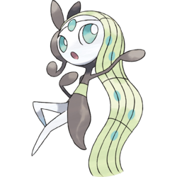

# Meloetta

<p align="center">
  
</p>

```bash
pip install meloetta
```

Meloetta is a Pokémon Battle Client for interacting with Pokémon Showdown written in Python. This project was born out of frustration for currently existing tools and their lack of dependency on Zarel's (PS Creator) existing code for handling client server interation.

The client works by reading messages from an asyncio stream and forwarding these to the javascript client battle object with PyMiniRacer. This concept was taken from [metagrok](https://github.com/yuzeh/metagrok).

Also, I have taken asyncio code from [pmariglia](https://github.com/pmariglia/showdown).

As is, the necessary javascript source files come with the pip install. Whenever Pokemon Showdown Client releases an update, the client code can also be automatically updated from the source.

# Quickstart

Make sure you have a localhost Pokemon Showdown Server running.

Then, see the code in [test.py](https://github.com/spktrm/meloetta/blob/main/meloetta/frameworks/nash_ketchum/train.py)

# Manual Sync (Optional)

```bash
git clone https://github.com/smogon/pokemon-showdown-client.git
cd pokemon-showdown-client
node build
```

Then run these commands in node (remeber to use the other backslash `\` on windows).

```bash
node pokemon-showdown-client/build-tools/build-indexes
node pokemon-showdown-client/build-tools/build-learnsets
```

Then finally run `extract.py` from the main directory. This will copy over the necessary source files.

# Defining Actors

Actors are classes to are used to interact with the state of the game. They usually parameterize some vectorized representation of the game and produce a policy distribution over discrete actions and/or some estimation of the value of the state of the game.

## Inheritance

All actors in herit from the base Actor class

```python
from meloetta.actors.base import Actor
```

## `choose_action`

All actors must define function `choose_action`. This function takes in 3 variables:
- `state`: A dictionary mapping of strings to torch tensors. A vectorized representation of the game before passing through the neural network
- `room`: A python object that is used to interface with the headless javascript client. This is important for accessing other hidden javascript variables from the client by using the `room.get_js_attr` function and also accessing `room.battle_tag`
- `choices`: A dictionary mapping choice indices to functions that are applied to the `room` object. These functions are equivalent to those that are executed in the pokemon showdown client in the browser when selecting a move/switch. **Note**: Some values in this dictionary can be None i.e. less than 6 pokemon or less than 4 moves.

This function must return a tuple of `func`, `args`, `kwargs`. This tuple is simply one of the values from provided `choices` dictionary and is equivalent to. In the [random actor](https://github.com/spktrm/meloetta/blob/main/meloetta/frameworks/random/train.py) implementation, this function is as expected:

```python
def choose_action(
    self,
    state: State,
    room: BattleRoom,
    choices: Choices,
):
    random_key = random.choice([key for key, value in choices.items() if value])
    _, (func, args, kwargs) = random.choice(list(choices[random_key].items()))
    return func, args, kwargs
```

## Optional: `post_match`

There is an optional `post_match` function to define, which is called after each match. It takes a singular argument, `room`. This can be used to append the reward via `room.get_reward()` to the end of trajectory for insertion into your replay buffer of choice

# Self-Play

One of the most important aspects to finding an optimal policy through reinforcement learning is through self-play.

To use your agents in self play, do so as follows:

```python
from meloetta.workers import SelfPlayWorker
...
worker = SelfPlayWorker(
    worker_index=0,
    num_players=2,  # 2 is players per worker
    battle_format="gen9randombattle",
    team="null",
    actor_fn=YOUR_ACTOR_CLASS,
    actor_args=(), # Optional args to be called when instantiating your actor
    actor_kwargs={}, # Optional kwargs to be called when instantiating your actor
)
worker.run()
```

# Evaluation

You can evaluate your agent against the two baseline actors provided, random and max damage.

This is down as follows:

```python
from meloetta.workers import EvalWorker
from meloetta.frameworks.random import RandomActor
...
worker = EvalWorker(
    eval_username="eval",
    opponent_username="random",
    battle_format="gen9randombattle",
    team="null",
    eval_actor_fn=YOUR_ACTOR_CLASS,
    eval_actor_args=(), # Optional args to be called when instantiating your actor
    eval_actor_kwargs={}, # Optional kwargs to be called when instantiating your actor
    baseline_actor_fn=RandomActor,
)
worker.run()
```

# Example Output

Below is an example of the state of the game that is collected.

**NOTE:** there are `{ "$ref": "$" }` scattered throughout the dictionary object. These are circular references found in the javascript object. I have logic that recontstructs the ciruclar references, but it impossible to show here

## State
```json
{
    "scene": {
        "animating": false,
        "acceleration": null,
        "gen": null,
        "activeCount": null,
        "numericId": null,
        "timeOffset": null,
        "interruptionCount": null,
        "messagebarOpen": false,
        "log": {}
    },
    "sidesSwitched": true,
    "stepQueue": [
        "|pm| p12| p13|/log p12 wants to battle!",
        "|pm| p13| p12|/challenge",
        "|updatesearch|{\"searching\":[],\"games\":{\"battle-gen1randombattle-2110292\":\"[Gen 1] Random Battle\"}}",
        "|updatesearch|{\"searching\":[],\"games\":{\"battle-gen1randombattle-2110292\":\"[Gen 1] Random Battle\",\"battle-gen1randombattle-2110303\":\"[Gen 1] Random Battle\"}}",
        "|updatesearch|{\"searching\":[],\"games\":{\"battle-gen1randombattle-2110292\":\"[Gen 1] Random Battle\",\"battle-gen1randombattle-2110303\":\"[Gen 1] Random Battle\"}}",
        "",
        "|pm| p13| p12|/nonotify p13 accepted the challenge, starting &laquo;<a href=\"/battle-gen1randombattle-2110303\">battle-gen1randombattle-2110303</a>&raquo;",
        "|t:|1671696539",
        "|gametype|singles",
        "|player|p1|p12|266|",
        "|player|p2|p13|2|",
        "|teamsize|p1|6",
        "|teamsize|p2|6",
        "|gen|1",
        "|tier|[Gen 1] Random Battle",
        "|rule|Desync Clause Mod: Desyncs changed to move failure.",
        "|rule|Sleep Clause Mod: Limit one foe put to sleep",
        "|rule|Freeze Clause Mod: Limit one foe frozen",
        "|rule|Species Clause: Limit one of each Pok\u00e9mon",
        "|rule|OHKO Clause: OHKO moves are banned",
        "|rule|Evasion Moves Clause: Evasion moves are banned",
        "|rule|Endless Battle Clause: Forcing endless battles is banned",
        "|rule|HP Percentage Mod: HP is shown in percentages",
        "|",
        "|t:|1671696539",
        "|start",
        "|switch|p1a: Beedrill|Beedrill, L77|100/100",
        "|switch|p2a: Oddish|Oddish, L88|259/259",
        "|turn|1"
    ],
    "preemptStepQueue": [],
    "waitForAnimations": true,
    "currentStep": 29,
    "seeking": null,
    "activeMoveIsSpread": null,
    "subscription": null,
    "mute": false,
    "messageFadeTime": 300,
    "messageShownTime": 1,
    "turnsSinceMoved": 1,
    "turn": 1,
    "atQueueEnd": true,
    "started": true,
    "ended": false,
    "isReplay": false,
    "usesUpkeep": false,
    "weather": "",
    "pseudoWeather": [],
    "weatherTimeLeft": 0,
    "weatherMinTimeLeft": 0,
    "mySide": {
        "battle": {
            "$ref": "$"
        },
        "name": "p13",
        "id": "p13",
        "sideid": "p2",
        "n": 1,
        "isFar": false,
        "foe": {
            "battle": {
                "$ref": "$"
            },
            "name": "p12",
            "id": "p12",
            "sideid": "p1",
            "n": 0,
            "isFar": true,
            "foe": {
                "$ref": "$[\"mySide\"]"
            },
            "ally": null,
            "avatar": "266",
            "rating": "",
            "totalPokemon": 6,
            "x": 0,
            "y": 0,
            "z": 0,
            "missedPokemon": null,
            "wisher": null,
            "active": [
                {
                    "name": "Beedrill",
                    "speciesForme": "Beedrill",
                    "ident": "p1: Beedrill",
                    "details": "Beedrill, L77",
                    "searchid": "p1: Beedrill|Beedrill, L77",
                    "side": {
                        "$ref": "$[\"mySide\"][\"foe\"]"
                    },
                    "slot": 0,
                    "fainted": false,
                    "hp": 100,
                    "maxhp": 100,
                    "level": 77,
                    "gender": "N",
                    "shiny": false,
                    "hpcolor": "",
                    "moves": [],
                    "ability": "",
                    "baseAbility": "",
                    "item": "",
                    "itemEffect": "",
                    "prevItem": "",
                    "prevItemEffect": "",
                    "teraType": "",
                    "boosts": {},
                    "status": "",
                    "statusStage": 0,
                    "volatiles": {},
                    "turnstatuses": {},
                    "movestatuses": {},
                    "lastMove": "",
                    "moveTrack": [],
                    "statusData": {
                        "sleepTurns": 0,
                        "toxicTurns": 0
                    },
                    "timesAttacked": 0,
                    "sprite": null
                }
            ],
            "lastPokemon": null,
            "pokemon": [
                {
                    "$ref": "$[\"mySide\"][\"foe\"][\"active\"][0]"
                }
            ],
            "sideConditions": {},
            "faintCounter": 0
        },
        "ally": null,
        "avatar": "2",
        "rating": "",
        "totalPokemon": 6,
        "x": 0,
        "y": 0,
        "z": 0,
        "missedPokemon": null,
        "wisher": null,
        "active": [
            {
                "name": "Oddish",
                "speciesForme": "Oddish",
                "ident": "p2: Oddish",
                "details": "Oddish, L88",
                "searchid": "p2: Oddish|Oddish, L88",
                "side": {
                    "$ref": "$[\"mySide\"]"
                },
                "slot": 0,
                "fainted": false,
                "hp": 259,
                "maxhp": 259,
                "level": 88,
                "gender": "N",
                "shiny": false,
                "hpcolor": "",
                "moves": [],
                "ability": "",
                "baseAbility": "",
                "item": "",
                "itemEffect": "",
                "prevItem": "",
                "prevItemEffect": "",
                "teraType": "",
                "boosts": {},
                "status": "",
                "statusStage": 0,
                "volatiles": {},
                "turnstatuses": {},
                "movestatuses": {},
                "lastMove": "",
                "moveTrack": [],
                "statusData": {
                    "sleepTurns": 0,
                    "toxicTurns": 0
                },
                "timesAttacked": 0,
                "sprite": null
            }
        ],
        "lastPokemon": null,
        "pokemon": [
            {
                "$ref": "$[\"mySide\"][\"active\"][0]"
            }
        ],
        "sideConditions": {},
        "faintCounter": 0
    },
    "nearSide": {
        "$ref": "$[\"mySide\"]"
    },
    "farSide": {
        "$ref": "$[\"mySide\"][\"foe\"]"
    },
    "p1": {
        "$ref": "$[\"mySide\"][\"foe\"]"
    },
    "p2": {
        "$ref": "$[\"mySide\"]"
    },
    "p3": null,
    "p4": null,
    "pokemonControlled": 1,
    "sides": [
        {
            "$ref": "$[\"mySide\"][\"foe\"]"
        },
        {
            "$ref": "$[\"mySide\"]"
        }
    ],
    "myPokemon": [
        {
            "ident": "p2: Oddish",
            "details": "Oddish, L88",
            "condition": "259/259",
            "active": true,
            "stats": {
                "atk": 174,
                "def": 183,
                "spa": 218,
                "spd": 218,
                "spe": 139
            },
            "moves": [
                "stunspore",
                "megadrain",
                "sleeppowder",
                "doubleedge"
            ],
            "baseAbility": "noability",
            "item": "",
            "commanding": false,
            "reviving": false,
            "pokeball": "pokeball",
            "name": "Oddish",
            "speciesForme": "Oddish",
            "level": 88,
            "shiny": false,
            "gender": "",
            "searchid": "p2: Oddish|Oddish, L88",
            "hpcolor": "",
            "hp": 259,
            "maxhp": 259,
            "status": ""
        },
        {
            "ident": "p2: Pidgeot",
            "details": "Pidgeot, L77",
            "condition": "286/286",
            "active": false,
            "stats": {
                "atk": 199,
                "def": 192,
                "spa": 184,
                "spd": 184,
                "spe": 216
            },
            "moves": [
                "skyattack",
                "agility",
                "hyperbeam",
                "doubleedge"
            ],
            "baseAbility": "noability",
            "item": "",
            "commanding": false,
            "reviving": false,
            "pokeball": "pokeball",
            "name": "Pidgeot",
            "speciesForme": "Pidgeot",
            "level": 77,
            "shiny": false,
            "gender": "",
            "searchid": "p2: Pidgeot|Pidgeot, L77",
            "hpcolor": "",
            "hp": 286,
            "maxhp": 286,
            "status": ""
        },
        {
            "ident": "p2: Pikachu",
            "details": "Pikachu, L88",
            "condition": "241/241",
            "active": false,
            "stats": {
                "atk": 183,
                "def": 139,
                "spa": 174,
                "spd": 174,
                "spe": 245
            },
            "moves": [
                "seismictoss",
                "thunderbolt",
                "thunderwave",
                "surf"
            ],
            "baseAbility": "noability",
            "item": "",
            "commanding": false,
            "reviving": false,
            "pokeball": "pokeball",
            "name": "Pikachu",
            "speciesForme": "Pikachu",
            "level": 88,
            "shiny": false,
            "gender": "",
            "searchid": "p2: Pikachu|Pikachu, L88",
            "hpcolor": "",
            "hp": 241,
            "maxhp": 241,
            "status": ""
        },
        {
            "ident": "p2: Growlithe",
            "details": "Growlithe, L88",
            "condition": "276/276",
            "active": false,
            "stats": {
                "atk": 210,
                "def": 166,
                "spa": 174,
                "spd": 174,
                "spe": 192
            },
            "moves": [
                "bodyslam",
                "fireblast",
                "reflect",
                "flamethrower"
            ],
            "baseAbility": "noability",
            "item": "",
            "commanding": false,
            "reviving": false,
            "pokeball": "pokeball",
            "name": "Growlithe",
            "speciesForme": "Growlithe",
            "level": 88,
            "shiny": false,
            "gender": "",
            "searchid": "p2: Growlithe|Growlithe, L88",
            "hpcolor": "",
            "hp": 276,
            "maxhp": 276,
            "status": ""
        },
        {
            "ident": "p2: Venomoth",
            "details": "Venomoth, L77",
            "condition": "266/266",
            "active": false,
            "stats": {
                "atk": 176,
                "def": 169,
                "spa": 215,
                "spd": 215,
                "spe": 215
            },
            "moves": [
                "megadrain",
                "psychic",
                "sleeppowder",
                "stunspore"
            ],
            "baseAbility": "noability",
            "item": "",
            "commanding": false,
            "reviving": false,
            "pokeball": "pokeball",
            "name": "Venomoth",
            "speciesForme": "Venomoth",
            "level": 77,
            "shiny": false,
            "gender": "",
            "searchid": "p2: Venomoth|Venomoth, L77",
            "hpcolor": "",
            "hp": 266,
            "maxhp": 266,
            "status": ""
        },
        {
            "ident": "p2: Seaking",
            "details": "Seaking, L77",
            "condition": "281/281",
            "active": false,
            "stats": {
                "atk": 218,
                "def": 176,
                "spa": 199,
                "spd": 199,
                "spe": 181
            },
            "moves": [
                "agility",
                "blizzard",
                "doubleedge",
                "surf"
            ],
            "baseAbility": "noability",
            "item": "",
            "commanding": false,
            "reviving": false,
            "pokeball": "pokeball",
            "name": "Seaking",
            "speciesForme": "Seaking",
            "level": 77,
            "shiny": false,
            "gender": "",
            "searchid": "p2: Seaking|Seaking, L77",
            "hpcolor": "",
            "hp": 281,
            "maxhp": 281,
            "status": ""
        }
    ],
    "myAllyPokemon": null,
    "lastMove": "switch-in",
    "gen": 1,
    "dex": {
        "gen": 1,
        "modid": "gen1",
        "cache": {
            "Moves": {},
            "Items": {},
            "Abilities": {},
            "Species": {},
            "Types": {}
        },
        "pokeballs": null,
        "moves": {},
        "items": {},
        "abilities": {},
        "species": {},
        "types": {}
    },
    "teamPreviewCount": 0,
    "speciesClause": true,
    "tier": "[Gen 1] Random Battle",
    "gameType": "singles",
    "rated": false,
    "rules": {
        "Desync Clause Mod": 1,
        "Sleep Clause Mod": 1,
        "Freeze Clause Mod": 1,
        "Species Clause": 1,
        "OHKO Clause": 1,
        "Evasion Moves Clause": 1,
        "Endless Battle Clause": 1,
        "HP Percentage Mod": 1
    },
    "isBlitz": false,
    "endLastTurnPending": true,
    "totalTimeLeft": 0,
    "graceTimeLeft": 0,
    "kickingInactive": false,
    "id": "",
    "roomid": "",
    "hardcoreMode": false,
    "ignoreNicks": false,
    "ignoreOpponent": false,
    "ignoreSpects": false,
    "debug": false,
    "joinButtons": false,
    "paused": false
}
```

## Request

The regular request from pokemon showdown is more detailed as well

```json
{
    "request": {
        "active": [
            {
                "moves": [
                    {
                        "move": "Slash",
                        "id": "slash",
                        "pp": 32,
                        "maxpp": 32,
                        "target": "normal",
                        "disabled": false,
                        "name": "Slash"
                    },
                    {
                        "move": "Hyper Beam",
                        "id": "hyperbeam",
                        "pp": 8,
                        "maxpp": 8,
                        "target": "normal",
                        "disabled": false,
                        "name": "Hyper Beam"
                    },
                    {
                        "move": "Swords Dance",
                        "id": "swordsdance",
                        "pp": 48,
                        "maxpp": 48,
                        "target": "self",
                        "disabled": false,
                        "name": "Swords Dance"
                    },
                    {
                        "move": "Agility",
                        "id": "agility",
                        "pp": 48,
                        "maxpp": 48,
                        "target": "self",
                        "disabled": false,
                        "name": "Agility"
                    }
                ]
            }
        ],
        "side": {
            "name": "p0",
            "id": "p1",
            "pokemon": [
                {
                    "ident": "p1: Scyther",
                    "details": "Scyther, L77",
                    "condition": "266/266",
                    "active": true,
                    "stats": {
                        "atk": 246,
                        "def": 199,
                        "spa": 161,
                        "spd": 161,
                        "spe": 238
                    },
                    "moves": [
                        "slash",
                        "hyperbeam",
                        "swordsdance",
                        "agility"
                    ],
                    "baseAbility": "noability",
                    "item": "",
                    "commanding": false,
                    "reviving": false,
                    "pokeball": "pokeball",
                    "name": "Scyther",
                    "speciesForme": "Scyther",
                    "level": 77,
                    "shiny": false,
                    "gender": "",
                    "searchid": "p1: Scyther|Scyther, L77",
                    "hpcolor": "",
                    "hp": 266,
                    "maxhp": 266,
                    "status": ""
                },
                {
                    "ident": "p1: Kabuto",
                    "details": "Kabuto, L88",
                    "condition": "232/232",
                    "active": false,
                    "stats": {
                        "atk": 227,
                        "def": 245,
                        "spa": 166,
                        "spd": 166,
                        "spe": 183
                    },
                    "moves": [
                        "bodyslam",
                        "surf",
                        "blizzard",
                        "slash"
                    ],
                    "baseAbility": "noability",
                    "item": "",
                    "commanding": false,
                    "reviving": false,
                    "pokeball": "pokeball",
                    "name": "Kabuto",
                    "speciesForme": "Kabuto",
                    "level": 88,
                    "shiny": false,
                    "gender": "",
                    "searchid": "p1: Kabuto|Kabuto, L88",
                    "hpcolor": "",
                    "hp": 232,
                    "maxhp": 232,
                    "status": ""
                },
                {
                    "ident": "p1: Mew",
                    "details": "Mew, L65",
                    "condition": "265/265",
                    "active": false,
                    "stats": {
                        "atk": 195,
                        "def": 195,
                        "spa": 195,
                        "spd": 195,
                        "spe": 195
                    },
                    "moves": [
                        "softboiled",
                        "psychic",
                        "earthquake",
                        "thunderbolt"
                    ],
                    "baseAbility": "noability",
                    "item": "",
                    "commanding": false,
                    "reviving": false,
                    "pokeball": "pokeball",
                    "name": "Mew",
                    "speciesForme": "Mew",
                    "level": 65,
                    "shiny": false,
                    "gender": "",
                    "searchid": "p1: Mew|Mew, L65",
                    "hpcolor": "",
                    "hp": 265,
                    "maxhp": 265,
                    "status": ""
                },
                {
                    "ident": "p1: Gengar",
                    "details": "Gengar, L68",
                    "condition": "222/222",
                    "active": false,
                    "stats": {
                        "atk": 156,
                        "def": 149,
                        "spa": 245,
                        "spd": 245,
                        "spe": 217
                    },
                    "moves": [
                        "hypnosis",
                        "thunderbolt",
                        "psychic",
                        "megadrain"
                    ],
                    "baseAbility": "noability",
                    "item": "",
                    "commanding": false,
                    "reviving": false,
                    "pokeball": "pokeball",
                    "name": "Gengar",
                    "speciesForme": "Gengar",
                    "level": 68,
                    "shiny": false,
                    "gender": "",
                    "searchid": "p1: Gengar|Gengar, L68",
                    "hpcolor": "",
                    "hp": 222,
                    "maxhp": 222,
                    "status": ""
                },
                {
                    "ident": "p1: Machoke",
                    "details": "Machoke, L80",
                    "condition": "292/292",
                    "active": false,
                    "stats": {
                        "atk": 239,
                        "def": 191,
                        "spa": 159,
                        "spd": 159,
                        "spe": 151
                    },
                    "moves": [
                        "rockslide",
                        "bodyslam",
                        "submission",
                        "earthquake"
                    ],
                    "baseAbility": "noability",
                    "item": "",
                    "commanding": false,
                    "reviving": false,
                    "pokeball": "pokeball",
                    "name": "Machoke",
                    "speciesForme": "Machoke",
                    "level": 80,
                    "shiny": false,
                    "gender": "",
                    "searchid": "p1: Machoke|Machoke, L80",
                    "hpcolor": "",
                    "hp": 292,
                    "maxhp": 292,
                    "status": ""
                },
                {
                    "ident": "p1: Diglett",
                    "details": "Diglett, L88",
                    "condition": "197/197",
                    "active": false,
                    "stats": {
                        "atk": 183,
                        "def": 130,
                        "spa": 166,
                        "spd": 166,
                        "spe": 254
                    },
                    "moves": [
                        "earthquake",
                        "rockslide",
                        "bodyslam",
                        "slash"
                    ],
                    "baseAbility": "noability",
                    "item": "",
                    "commanding": false,
                    "reviving": false,
                    "pokeball": "pokeball",
                    "name": "Diglett",
                    "speciesForme": "Diglett",
                    "level": 88,
                    "shiny": false,
                    "gender": "",
                    "searchid": "p1: Diglett|Diglett, L88",
                    "hpcolor": "",
                    "hp": 197,
                    "maxhp": 197,
                    "status": ""
                }
            ]
        },
        "rqid": 2,
        "requestType": "move"
    },
    "choices": [],
    "current": {
        "choiceType": "move",
        "move": 0,
        "targetLoc": 0,
        "mega": false,
        "ultra": false,
        "z": false,
        "max": false,
        "tera": false
    },
    "alreadySwitchingIn": [],
    "alreadyMega": false,
    "alreadyMax": false,
    "alreadyZ": false,
    "alreadyTera": false
}
```
